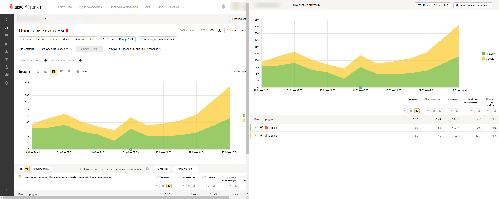

## Установка
1. Поставьте Tampermonkey для 
   [Chrome](https://chrome.google.com/webstore/detail/tampermonkey/dhdgffkkebhmkfjojejmpbldmpobfkfo?hl=ru)
   или
   [Firefox](https://addons.mozilla.org/en-US/firefox/addon/tampermonkey/)
2. Перейдите на [страницу расширения](https://github.com/viasite/userscript-yandex-metrika-screenshot/raw/master/yandex-metrika-screenshot.user.js)
3. На открывшейся странице нажмите Установить

После этого в нижнем правом углу отчётов появится кнопка "Скриншот".

## Что делает
- Добавляет в правый нижний угол Метрики кнопку "Скриншот"
- Убирает лишнее со страницы, так, чтобы можно было сделать скриншот всей страницы
- Минимальная ширина страницы 600 точек, а не 1300, как обычно
- Компонует всю доп. инфу в строку шапки
- Убирает с графика метки праздников (красные `H`)
- Убирает невыбранные строки из таблицы

Слева обычная Яндекс.Метрика, справа - версия для скриншота:

